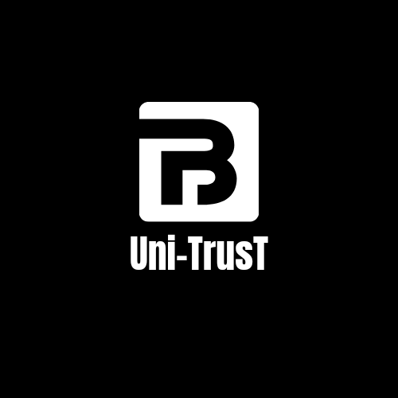

# Grizzlython_project

UNITRUST platform is a decentralized, blockchain-based platform that connects university's communities and companies to support education, innovation, and events. The platform is built on Solana blockchain, which provides fast, secure, and cost-effective transaction processing.  

The platform allows university's communities to create fundraising campaigns for their initiatives and events. Companies can browse these campaigns and choose to donate funds to specific projects that align with their values and mission. Donors can also browse campaigns and donate funds directly to support university initiatives.  

All transactions on the platform are recorded on the Solana blockchain, which ensures transparency, security, and accountability for all parties involved. Smart contracts are used to automate the disbursement of funds once certain conditions are met, such as reaching a fundraising goal or completing a project milestone.  

The platform also includes a social networking feature that allows universities, companies, and donors to connect and collaborate on fundraising initiatives. This feature can help to build stronger relationships between universities and companies, while also providing donors with more opportunities to engage with the causes they care about.  

Overall, the university community funding platform provides a powerful tool for supporting education, innovation, and events at universities. By leveraging the power of Solana blockchain, the platform provides a fast, secure, and transparent way to connect universities, companies, and donors in support of these important initiatives.  

